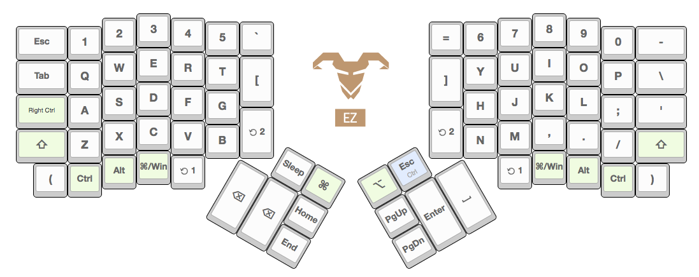
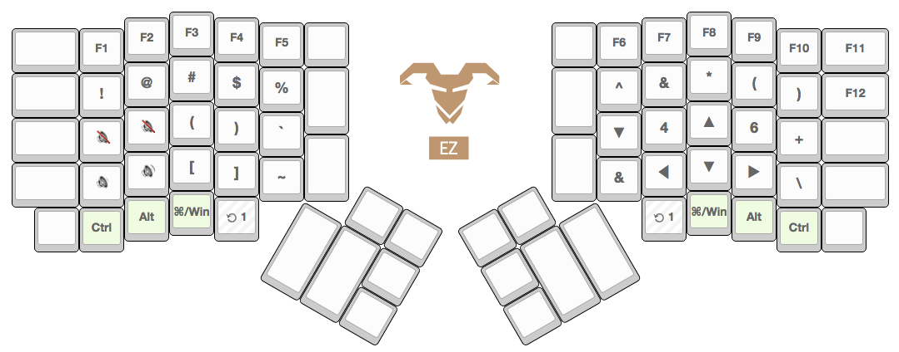
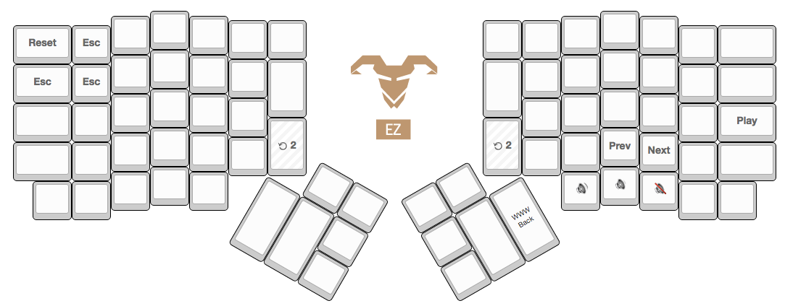

An ergodox layout that borrows a little bit from planck.

I was bitter about how bad the layout is for Vortex Core so I'm going to turn
my ergodox into a usable 40% until I actually manage to get a planck in my
life.

Still a major work in progress.

## default

Default layer has some problems, like that double delete -- but I haven't
figured out yet what to put there.

Delete and Enter are kind of volatile keys,
so I feel sketchy about the enter being so close to the space key.  Smacking
Enter with right pinkie is a hard habit to get out of. In the meantime I'm
focusing on the other usability concerns like how to get the extra layers in an
accessible place without completely relearning how to use cmd/ctrl/alt.

## Layer 1

Both layers beyond the default layer are accessible with either hand.  Layer
1's activation key is in prime thumb location, right where the thumb would
hover at rest. The goal of this position is to make that layer as easy to reach
as possible.  Because the rest of your fingers can have maximum mobility when
the layer 1 is active, you're easily doubling the key count on your keyboard
with this position.

I've opted to NOT go for the standard "layer lock" approach I see so many
default ergodox layouts use. The reason for this is that this introduces mode
error whenever you have an interface that can rest in a certain mode.  It's too
easy to enter the mode and forget which mode you're in.  Even if you have a
keyboard that visually indicates which mode it's in, you're not going to sit
there watching it as you type.

It's always better to implement modular interfaces with a tactile element.  You
need to physically hold the keyboard in that mode by holding down a key.  Then
you design an interface which is learned through muscle memory -- a cognitive
faculty that you can leverage without conscious effort once you've given enough
time in training.

## Layer 2

Layer 2 is less interesting, just a grab bag of functions.  As I figure out
what I need as I type and as I get more fluent at using layers this will get
fleshed out.  Layer 2 is kind of cumbersome to activate, haven't really figured
out if I want this here or want to migrate the layer functions to the thumb
clusters and restore traditional delete and enter buttons to their regular
positions.  

Fortunately Layer 2 has a feature that I couldn't get to work from the massdrop
firmware, a button you can push to trigger the firmware reload.  Hopefully this
means it'll be easier to iterate quicker when I don't have to fish a piece of
wire from somewhere in order to reach the reset button.
